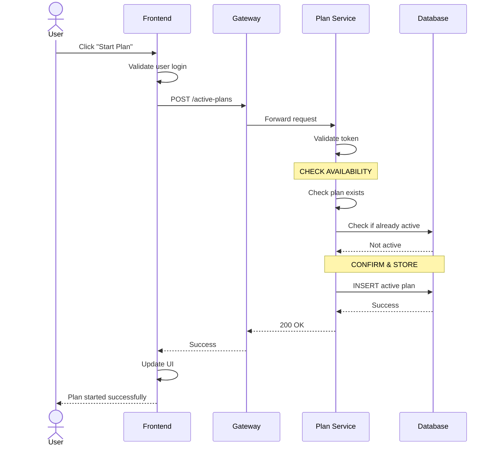
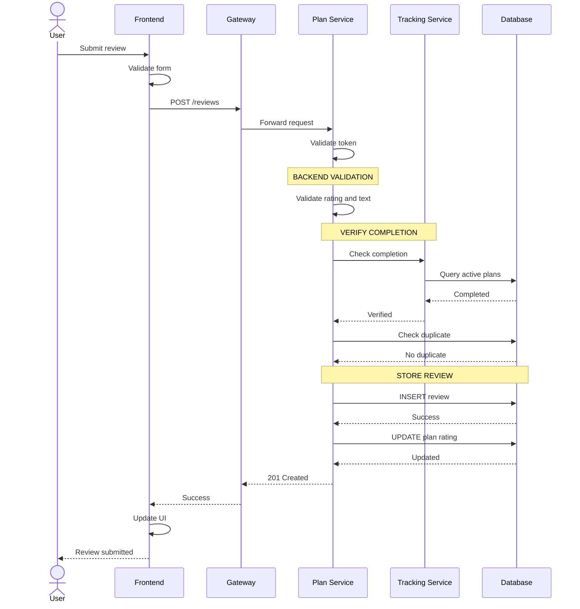
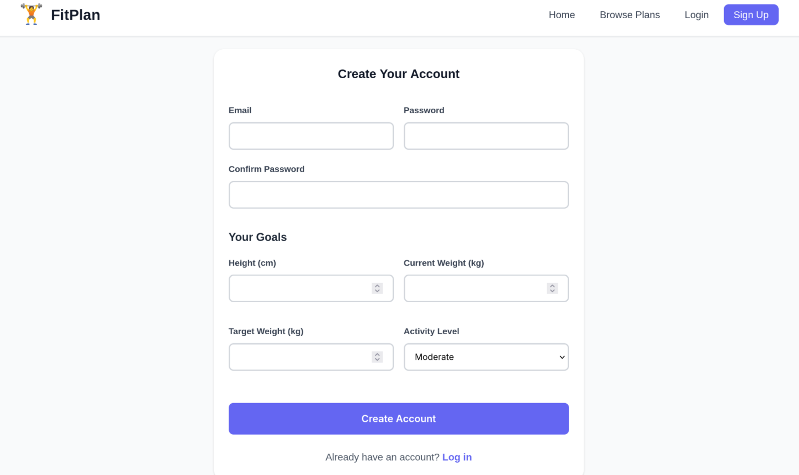
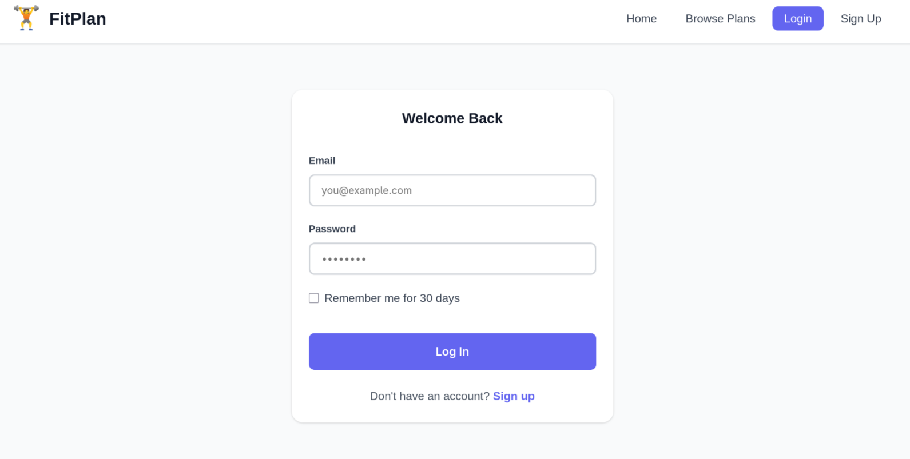
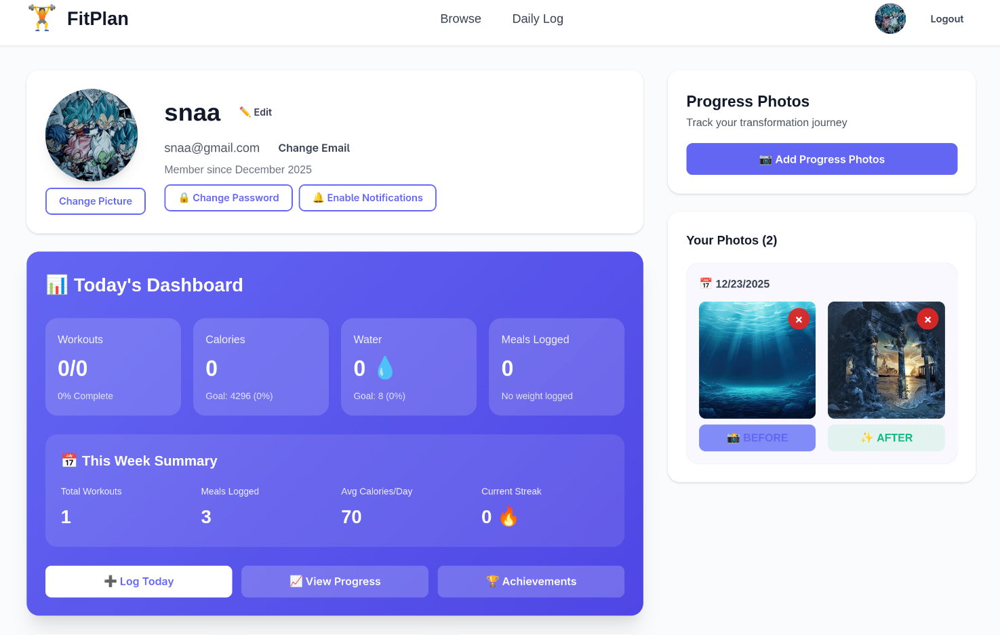
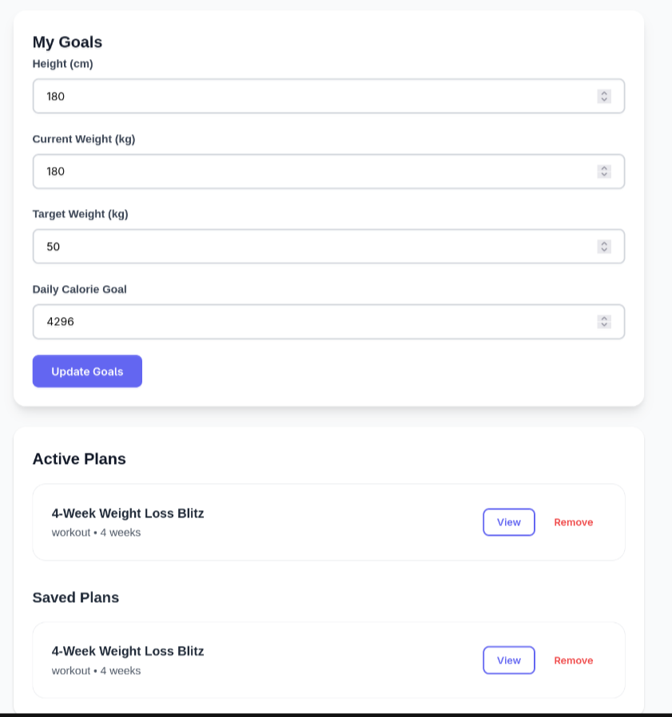
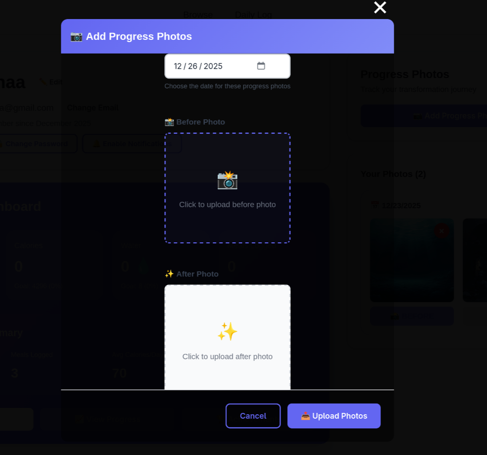

# FitPlan - Fitness Journey Management Platform

**FitPlan** is a full-stack fitness management platform built with FastAPI (Python) and Vanilla JavaScript that connects fitness enthusiasts with personalized workout and meal plans through seamless plan discovery, daily logging, and progress tracking capabilities.

## Roles

**1. Visitor (Unauthenticated User)**: View landing page with platform overview and benefits. Access registration to create user account. View login page for existing users.

**2. Registered User**: Browse workout and meal plans with filtering by goals, difficulty, duration, and diet type. View detailed plan information including schedules, exercises, and nutrition. Save plans to favorites/wishlist. Start and track active plans. Log daily activities including workouts, meals, water intake, and weight. Track progress with visual charts and statistics. Upload progress photos. Update profile information and fitness goals.

## Features

* User Authentication & Profile Management**: Secure JWT-based authentication with password hashing. User registration with fitness profile setup (height, weight, activity level). Profile updates including current weight, target weight, and daily caloric goals. Avatar and progress photo management.

* Plan Browsing & Discovery**: Tabbed interface for workout and meal plans (8 total plans: 4 workout + 4 meal). Filter by goal (weight loss, muscle gain, endurance, health), difficulty (beginner, intermediate, advanced), duration (4-12 weeks), and diet type (high protein, Mediterranean, low calorie, vegan). Plan cards display key metadata, difficulty badges, and favorite toggle. Clear filters functionality.

* Interactive Plan Details**: Three-tab layout (Overview, Schedule, Details). Weekly schedule breakdown with daily activities. Embedded YouTube exercise videos for workout plans. Nutrition information and meal options for meal plans. PDF download links. "Start Today" button to activate plans. Save/favorite toggle for quick access.

* Daily Activity Logging**: Date-based logging system with persistent storage. Weight tracking with visual progress charts. Water intake counter with increment/decrement buttons. Workout completion checklist with custom workout additions. Food search with 100+ item database across 10 categories. Meal logging with automatic macro calculation (calories, protein, carbs, fat). Daily caloric goal tracking with visual feedback.

* Progress Tracking & Analytics**: Profile dashboard with key statistics (workouts completed, active streak, completed plans). Weight progress visualization with canvas-based charts. Historical weight data tracking. Photo upload system (before/after/progress categories). Progress photo gallery. Caloric goal management and recommendations.

* Favorites/Wishlist System**: Bookmark unlimited workout and meal plans. Quick toggle add/remove from browse and detail pages. Dedicated favorites section in profile. One-click navigation to favorited plans.

## Additional Features
Extensive nutrition database with 100+ food items organized by category: **Breakfast** (oatmeal, eggs, yogurt), **Lunch** (chicken, salmon, rice), **Dinner** (beef, pasta, shrimp), **Snacks** (nuts, protein bars, fruits), **Drinks** (water, protein shakes, juice), **Grains**, **Vegetables**, **Fruits**, **Proteins**, and **Dairy**. Each item includes complete macro breakdown (calories, protein, carbs, fat). Real-time search with suggestions dropdown. Automatic daily totals calculation for meal logging.

# Installation Guide

This guide will walk you through setting up the FitPlan application on your local machine.

## Table of Contents

- [Prerequisites](#prerequisites)
- [Backend Setup](#backend-setup)
- [Frontend Setup](#frontend-setup)
- [Running the Application](#running-the-application)
- [Verification](#verification)
- [Troubleshooting](#troubleshooting)

## Prerequisites

Before you begin, ensure you have the following installed on your system:

- **Python 3.13+** - [Download Python](https://www.python.org/downloads/)
- **pip** - Python package manager (included with Python)
- **Web Browser** - Modern browser (Chrome, Firefox, Safari, Edge)
- **Terminal/Command Line** - For running commands

### Check Your Python Version

```bash
python --version
# or
python3 --version
```

Expected output: `Python 3.13.x` or higher

## Backend Setup

### 1. Navigate to Backend Directory

```bash
cd backend
```

### 2. Create Virtual Environment

```bash
python -m venv venv
# or
python3 -m venv venv
```

### 3. Activate Virtual Environment

**On Linux/macOS:**
```bash
source venv/bin/activate
```

**On Windows:**
```cmd
venv\Scripts\activate
```

You should see `(venv)` prefix in your terminal prompt.

### 4. Install Dependencies

```bash
pip install -r requirements.txt
```

This will install:
- FastAPI (web framework)
- Uvicorn (ASGI server)
- SQLAlchemy (database ORM)
- Pydantic (data validation)
- Python-JOSE (JWT tokens)
- Passlib & Bcrypt (password hashing)
- HTTPX (HTTP client)
- Python-Multipart (file uploads)

### 5. Initialize Database

The database will be created automatically when you first start the services. SQLite database files will be created in the `backend` directory.

### 6. Make Scripts Executable (Linux/macOS only)

```bash
chmod +x start_services.sh stop_services.sh
```

## Frontend Setup

The frontend is built with vanilla JavaScript and requires no build process or dependencies.

### 1. Navigate to Project Root

```bash
cd /path/to/FrontEnd
```

### 2. Verify File Structure

Ensure the following directories exist:
- `html/` - HTML pages
- `css/` - Stylesheets
- `js/` - JavaScript modules
- `images/` - Image assets
- `backend/` - Backend services

## Running the Application

### Option 1: Using the Start Script (Recommended - Linux/macOS)

```bash
cd backend
./start_services.sh
```

This will:
- Activate the virtual environment
- Start all 5 microservices
- Create log files in `backend/logs/`
- Display service URLs

### Option 2: Manual Start (Windows/All Platforms)

Open **5 separate terminal windows** and run each service:

**Terminal 1 - Auth Service:**
```bash
cd backend
source venv/bin/activate  # On Windows: venv\Scripts\activate
python services/auth_service.py
```

**Terminal 2 - User Service:**
```bash
cd backend
source venv/bin/activate
python services/user_service.py
```

**Terminal 3 - Plan Service:**
```bash
cd backend
source venv/bin/activate
python services/plan_service.py
```

**Terminal 4 - Tracking Service:**
```bash
cd backend
source venv/bin/activate
python services/tracking_service.py
```

**Terminal 5 - API Gateway:**
```bash
cd backend
source venv/bin/activate
python gateway/main.py
```

### Starting the Frontend

The frontend is static and can be served in multiple ways:

#### Option A: Python HTTP Server (Recommended)

In a new terminal from the project root:

```bash
python -m http.server 3000
# or
python3 -m http.server 3000
```

Access the app at: `http://localhost:3000/html/index.html`

#### Option B: VS Code Live Server

1. Install "Live Server" extension in VS Code
2. Right-click `html/index.html`
3. Select "Open with Live Server"

#### Option C: Direct File Access

Simply open `html/index.html` in your browser (some features may not work due to CORS).

## Architecture Diagram


## Sequence Diagrams

## Scenario A — Following/Starting a Workout Plan

**Simple Flow**: User selects plan → System checks availability → Confirms → Stores active plan



---

## Scenario B — Rating/Reviewing a Plan

**Simple Flow**: User submits review → System validates → Checks completion → Stores review → Returns success




---

### Summary

### Scenario A (Following Plan):
1. User clicks "Start Plan"
2. Frontend sends request with auth
3. Plan Service checks plan exists
4. Check if not already active
5. Store active plan in DB
6. Return success + update UI

### Scenario B (Rating/Review):
1. User submits rating + review text
2. Frontend validates form
3. Plan Service validates data
4. Tracking Service verifies completion
5. Check no duplicate review
6. Store review + update plan rating
7. Return success + update UI

## Database Schema


## API Endpoints

### Authentication Service
- `POST /api/auth/register` - Register new user
- `POST /api/auth/login` - Login user (returns JWT)
- `POST /api/auth/logout` - Logout user
- `GET /api/auth/verify` - Verify JWT token

### User Service
- `GET /api/user/profile` - Get user profile
- `PUT /api/user/profile` - Update user profile
- `PUT /api/user/weight` - Update current weight
- `PUT /api/user/target-weight` - Update target weight
- `PUT /api/user/caloric-goal` - Update daily caloric goal
- `GET /api/user/progress` - Get progress data

### Plan Service
- `GET /api/plans` - Get all plans (with filters)
- `GET /api/plans/{id}` - Get plan details
- `POST /api/plans/activate` - Activate a plan
- `GET /api/plans/active` - Get user's active plans
- `PUT /api/plans/active/{id}` - Update active plan status

### Tracking Service
- `GET /api/tracking/logs` - Get user's daily logs
- `GET /api/tracking/logs/{date}` - Get log for specific date
- `POST /api/tracking/log` - Create or update daily log
- `POST /api/tracking/add-meal` - Add meal to log
- `DELETE /api/tracking/remove-meal` - Remove meal from log
- `POST /api/tracking/add-workout` - Add workout to log
- `DELETE /api/tracking/remove-workout` - Remove workout from log

### Favorites Service
- `GET /api/favorites` - Get user's favorite plans
- `POST /api/favorites/{plan_id}` - Add plan to favorites
- `DELETE /api/favorites/{plan_id}` - Remove plan from favorites

### Food Database Service
- `GET /api/foods` - Get all food items
- `GET /api/foods/search?q={query}` - Search food items
- `GET /api/foods/category/{category}` - Get foods by category

## Technology Stack

**Frontend:**
- Vanilla JavaScript
- HTML & CSS


**Backend:**
- Python 3.13
- FastAPI framework
- JWT authentication
- RESTful API architecture
- Microservices pattern

**Database:**
- SQLite
- SQLAlchemy

**Deployment:**
- Frontend: Static file hosting
- Backend: Docker containers with service orchestration
- Gateway: API Gateway pattern for service routing

## Key Features Summary

- **8 Pre-built Plans**: 4 workout plans + 4 meal plans covering various fitness goals
- **100+ Food Database**: Comprehensive nutrition database with full macro breakdowns
- **Real-time Logging**: Daily activity tracking with persistent storage
- **Visual Progress**: Canvas-based weight charts and progress visualization
- **Responsive Design**: Fully responsive CSS with mobile-first approach
- **No Dependencies**: Pure vanilla JavaScript with no external libraries
- **Secure Authentication**: JWT-based auth with password hashing
- **Microservices Architecture**: Scalable backend with service separation
- **Photo Tracking**: Progress photo upload and gallery system
- **Smart Filtering**: Multi-criteria plan filtering and search

## Project Statistics

- **Total Plans**: 8 (4 workout + 4 meal)
- **Food Items**: 100+ across 10 categories
- **API Endpoints**: 25+ RESTful endpoints
- **Frontend Files**: 8 JavaScript modules + 6 CSS files
- **Backend Services**: 5 microservices (Auth, User, Plan, Tracking, Gateway)
- **Lines of Code**: 5,000+ (frontend + backend)
- **No Build Process**: Works directly in browsers
- **Zero Dependencies**: No npm packages required for frontend

## Screenshots
**1. Home(pre Regsiter/Login)**
.png)

---

**2. Register/Login**
* 1.1. Register


* 1.2. Login


---

**3. Browse Plans**
.png)

---

**4. Indepth Plan**


---

**5. Daliy Log**


---

**6. Profile**


---

**7. Update Goals_Active Plans_Saved Plans**


---

**8. Before-after Photos**

